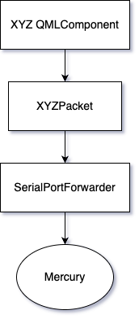

# Helios-Sentinel

## Setup Guide

### Required Libraries
- Qt Core
- Qt Gui
- Qt Qml
- Qt Quick
- Qt Serial Port: Used to send data to Mercury
    - Can be installed through Maintenance Tool if it was not originally installed with Qt
- Socat: Used to set up virtual serial ports
    - In a terminal, run the following command:
        - sudo apt install socat (for Linux)
        - brew install socat (for Mac)

#### Qt Versions
- Currently, we are using version 6.7.2

### Before Building
We need to setup two virtual serial port using the socat command.
These serial ports connect Sentinel with Mercury. In a terminal, run the following command:

`socat -d -d pty,raw,echo=0 pty,raw,echo=0`

The terminal will output two virtual serial ports. In either Qt Creator or Visual Studio Code,
navigate to src/main.cpp. On line 30, replace the string argument with one of the serial ports from
the terminal. Sentinel is now ready to build and run.

### Building From Terminal
In a terminal, navigate to the Sentinel repository. Run the following commands:

#### Step 1
`mkdir build`

`cd build`

#### Step 2
For Linux:

`path/to/Qt/6.7.2/gcc_64/bin/qt-cmake ..`

For Mac:

`path/to/Qt/6.7.2/macos/bin/qt-cmake ..`

#### Step 3
`make`

### Running the Application
`./Sentinel`

## Architecture Diagram

